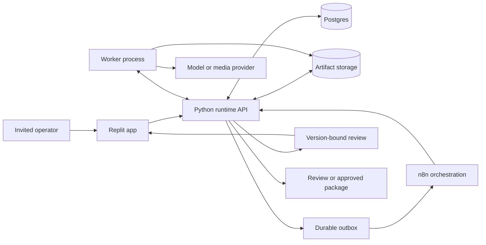

# Vista Launch Factory hosted workflow design, Phase B

Status: proposed for Gabe's review. This document plans the build; it starts no worker, provider call, deployment or Ralph loop.

Reggie's latest message explicitly accepts local execution for this test project and prioritizes low-production edits of human/UI footage. The call remains September 9. The immediate execution target is the [local demo loop](../plans/2026-09-09-vista-demo-local-loop.md). This hosted design is the roadmap after that presentation. Its app, service-auth and recipient-infrastructure gates are not prerequisites for the accepted local test.

Planning baseline: `nova/factory-house` at `34c887450dbf135bceb320c982f92b707e72f9a8`. Intended implementation baseline: the audited candidate `627c93fb23ae3a1ecd1cdb979396c8d23459b295` in [PR #41](https://github.com/gabchess/vista-launch-factory/pull/41). That PR is open and unmerged. A later worktree may branch from its exact head without merging it into either target branch. Gabe owns PR merges.

## Outcome

An invited marketing operator opens the app, submits a public release URL, answers the missing brief questions and starts a campaign. The system retrieves the source, generates six output categories and a campaign, and presents the actual artifacts with their source context. The operator requests a revision, returns after an interruption and downloads the resulting review package. The recording, job receipts and exported bytes describe the same run.

The first hosted milestone proves this journey with one blog. Completion requires all six categories. A working blog is an integration checkpoint.

## Source and audience decision

Gabe's latest instruction says there is no supplied Vista release folder and authorizes proceeding with available sources. Private access is not an engineering prerequisite for this loop.

Use **Vista Work: linked tasks and the work behind a social post** for the client-facing campaign. The public launch article and help center describe a relevant released feature. The audience comes from Reggie's answers: in-house social media managers and directors at brands with 100–1,000 employees, often working in a social team of 3–5. The problem is finding the caption, creative and review feedback across separate tools.

Use these sources:

| Source | Role in the run | Limitation |
| --- | --- | --- |
| [Vista Work announcement](https://vistasocial.com/insights/vista-work-social-media-project-management/) | Release context, published August 24, 2026, and official product imagery | Publication date is evidence of the announcement; do not manufacture a deployment timestamp or call the feature newly launched today. |
| [Linked tasks guide](https://support.vistasocial.com/hc/en-us/articles/54580849305243-Linking-Vista-Work-tasks-to-the-rest-of-Vista-Social) | Task links, current linked-item state and the task creation flow | A documented capability is not a live account test by this team. |
| [Getting started](https://support.vistasocial.com/hc/en-us/articles/54580761228699-Getting-started-with-Vista-Work) | Work sidebar access and project context | The public pages use different entitlement wording. Omit plan and pricing assertions until that discrepancy is resolved. |
| `voice-bank/corpus/01-email-barry-approval-queue.md` | Existing email voice seed | Repository attribution says Barry/Reggie; this planning pass did not re-authenticate its original delivery. It is one sample. |
| Existing original Vista channel analysis and brand references | Writing format and visual design | Public login styling does not establish acceptance of a feature-announcement popup. |

Capture source bytes, final URL, retrieval time, content hash and the role of each source. Keep fact material and expression references distinct. Preserve article images with source and usage records. A source folder assembled from public pages must say how it was assembled. Do not invent a Loom, private footage or a client-supplied release document.

Tix remains the regression campaign. Preserve its two approved masters. A later Tix social rendition has its own claim and placement review. The public Vista Work run must produce its own artifacts; renaming a Tix output does not count.

GitHub URL intake stays in scope for the reusable factory. Use a pinned Tix repository revision as its second-source test. Prospector is optional after this path passes. AskVista is supporting context for the campaign. Reggie's 30–40%, 300% and tool-count statements are not a basis for unsupported performance copy.

## What the audit changes

The full [SDS report](https://github.com/gabchess/vista-launch-factory/blob/627c93fb23ae3a1ecd1cdb979396c8d23459b295/docs/audits/sds-trial-2026-09-09/REPORT.md), control review and pre-mortem inform this design. The original v2 brief was read in full. Its hash is `82652c807fe6123793ff19ab44f8457488ab5c7af0eca38db8110f7c46976769`.

| Finding | Response | Evidence needed to close |
| --- | --- | --- |
| F-01, preparation stops before generation | Add a durable runtime and provider workers. Keep preparation contracts reusable. | A fresh source reaches all six materialized categories through runtime jobs. |
| F-02, no operator run or full recording | Build app intake early. Retain the raw full-run recording and a second person's repeat run. | App-only operation, matching run IDs, recovery and review-package download. |
| F-03, source and voice fit | Use public Vista Work evidence, include the existing email seed, write separate lead/customer actions. | Frozen source/voice packet and actual editorial review. Private input coverage stays untested. |
| F-04, film approval differs from claim support | Preserve the Tix master; use source-supported Vista material for this run. Validate speech and UI assertions alongside copy. | Social rendition review, complete listening and caption checks. A separate Tix export must retain adequate concept context. |
| F-05, recipient verification fails | Start from PR #41's portable-context fix. | Regression suite plus a genuine independent checkout/install test. A symlink to the builder's engine does not count as that install test. |
| F-06, stale guidance and duration attribution | Carry the audit corrections into new docs and recording instructions. | No client-attributed numeric duration cap; historical fixtures remain clearly identified. |
| F-07, approval/export authority missing | Store authenticated decisions and validate the exact source/artifact version at export. | Stale, wrong-user, duplicate and late-callback cases cannot produce a falsely approved export. |

The brief asks for review-ready assets at presentation. Barry's final acceptance is required before client publication. A review package may therefore contain pending decisions. It must expose them accurately.

## Approaches considered

| Approach | Useful property | Cost for this task | Decision |
| --- | --- | --- | --- |
| Replit app, Python runtime, Postgres and n8n | Reuses the Python validators and leaves ordinary code an engineer can inspect. Supports a persistent worker separate from HTTP requests. | Requires explicit auth, storage and worker setup. | Recommended. Prove the hosting seam before expanding. |
| Base44 app calling the same external runtime | Provides an app shell, auth/data features and HTTP backend functions. | Still needs a separate long-running worker and a careful callback/auth boundary. Rewriting runtime state in Base44 would duplicate ownership. | Viable host adapter if the first Replit deployment test fails. No parallel build. |
| n8n forms with n8n execution data as campaign truth | Fast input form and visible workflow graph. | Exact-version review, rich artifact display and portable persistent state would become awkward custom work. | A form can be a diagnostic trigger. It is not the selected operator experience. |

Replit documents Reserved VM support for background work and warns against relying on a published app's filesystem for persistent data. Base44 documents Deno backend functions and HTTP endpoints; these are not evidence that our render worker already runs there. n8n supports authenticated webhooks and database-backed Wait execution. These capabilities support the design but do not replace a deployment test. See [deployment types](https://docs.replit.com/features/publishing/deployment-types), [persistent app data](https://docs.replit.com/build/troubleshooting), [Base44 functions](https://docs.base44.com/developers/backend/resources/backend-functions/overview), and [n8n Wait](https://docs.n8n.io/integrations/builtin/core-nodes/n8n-nodes-base.wait/).

## Architecture and ownership

The runtime owns domain state and decisions. Postgres stores that state durably. n8n coordinates work by calling authenticated runtime commands; its execution ID is a useful trace field. It cannot turn a prepared packet or a webhook payload into human approval.

Use one Python package for the API, domain rules and worker. Serve the built React/Vite app from the API deployment or a same-origin host arrangement. Run long generation jobs in a worker process. Use a persistent Postgres database and object storage. Replit's managed options are the initial deployment candidates; database and artifact interfaces must also support an engineer's own installation. Start with one workspace and invited users. Multi-tenant billing and an organization administration suite are outside this loop.

The initial host test must establish sign-in, a committed database row, a stored artifact, an authenticated n8n callback and a worker result after browser reload and process restart. Select and pin the actual versions, auth provider and deployment commands in that test's receipt. Do not infer service readiness from an installed MCP.

### Module map

Existing modules retained:

- `engine/scripts/specialist_route.py`: `route_request`, `validate_result` and `check_decision_binding` remain source/context validators. They grant no runtime authority.
- `engine/specialists/`: role protocols, original prompts, video recipes and source/voice references.
- `automation/n8n/channel-production/` and `automation/n8n/ugc-app-reveal/`: preparation stages with their current false authority flags.
- `packages/camp_tix_launch_001/`: historical test artifacts and acceptance records.

Proposed modules:

| Path | Responsibility |
| --- | --- |
| `engine/runtime/contracts.py` | Commands, events and response models |
| `engine/runtime/store.py`, `engine/runtime/migrations/` | Atomic state changes, unique keys, job leases, budget and outbox records |
| `engine/runtime/sources.py` | Public URL/GitHub retrieval, immutable snapshots and source-role assignment |
| `engine/runtime/jobs.py`, `engine/runtime/worker.py` | Job admission, submission, reconciliation and validation |
| `engine/runtime/review.py`, `engine/runtime/export.py` | Human decisions and exact-version package checks |
| `engine/runtime/providers/` | One verified text adapter, media/render adapters and capability receipts |
| `engine/runtime/api.py`, `engine/runtime/auth.py` | HTTP parsing, authenticated identities, workspace access and service credentials |
| `app/` | Source intake, brief chat, progress, actual previews, decisions and recovery controls |
| `renderers/` | Original animation and social templates, captions and media assembly |
| `automation/n8n/runtime/` | Controller workflows over the runtime command API |
| `tests/runtime/`, `tests/e2e/` | Contract, restart, stale-decision and operator-journey tests |
| `runs/<run_id>/` | Private runtime evidence, separate from distributable source |

### Domain records

`Campaign` identifies the product, reviewer assignment, source snapshot, voice profile, output plan and cost allowance. `SourceSnapshot` identifies captured inputs and a portable digest. `AssetVersion` identifies the exact bytes, source/voice context, rendition settings and validation result. `JobAttempt` records submission intent, request fingerprint, provider job ID, observation and cost reservation. `ReviewDecision` records an authenticated person and an exact asset subject. `ExportManifest` records the selected versions and export mode.

Keep these state machines distinct:

| Record | States |
| --- | --- |
| Campaign | collecting, awaiting_brief, generating, waiting_for_review, review_ready, paused, failed, cancelled |
| Job | queued, submission_pending, submitted, running, reconciling, succeeded, failed, cancelled |
| Asset version | draft, validation_failed, needs_review, changes_requested, approved, superseded |
| Export | review_bundle, approved_bundle |

`review_ready` means all required output categories exist, can be opened and pass the configured checks. It does not mean approved. The five email variants form one category and have separate review subjects. Approving a script does not approve the resulting video. Artifact objects are immutable. An approved export checks current bindings before assembly and again before granting access, so a concurrent update cannot release stale bytes.

### Runtime command boundary

The implementation plan defines fixtures around these endpoints. All writes require an authenticated operator/reviewer or the designated service credential. Server-side assignment determines authority.

| Method and path | Input/result |
| --- | --- |
| `POST /v1/campaigns` | Source URL, product selection and audience request plus `Idempotency-Key`; returns campaign ID and collecting status. |
| `GET /v1/campaigns/{id}` | Current brief, jobs, asset versions, findings and next human action. |
| `POST /v1/campaigns/{id}/brief` | Confirm a displayed source/voice/output-plan digest; records the actual operator. |
| `POST /v1/campaigns/{id}/generate` | Expected brief digest; admits jobs under the server's budget and retry limits. |
| `POST /v1/jobs/{id}/observations` | Authenticated service observation with event ID, attempt ID, provider job ID and artifact hashes. |
| `POST /v1/assets/{id}/decisions` | Approve or request changes against version, content digest and context digest; actor comes from the verified session. |
| `POST /v1/campaigns/{id}/pause` and `/resume` | Preserve state and control future dispatch. Unknown submissions require reconciliation before resumption. |
| `POST /v1/campaigns/{id}/exports` | Expected manifest digest and review/approved mode; returns an immutable export after current-state checks. |

Return `202` for accepted work, `409` for stale or conflicting state, `403` for wrong authority and `422` for incomplete input. A repeated command with the same key and body returns the original result. Reusing its key with different input returns a conflict. Reads and signed artifact access must enforce the campaign's workspace too.

### Restart, retries and budget

Write submission intent and reserve its cost before calling a paid provider. A timeout after submission does not prove failure. Reconcile using the provider's idempotency mechanism or job lookup. If neither can establish the outcome, set `reconciling`, retain the reservation and pause additional paid dispatch for that affected path. The operator gets an explicit recovery action. Do not claim exactly-once external execution when a provider cannot guarantee it.

Use the following proposed operating limits, recorded as internal settings rather than client requirements:

- One active render and at most two text jobs per campaign.
- At most three technical attempts for a known retryable failure. Respect a provider's retry-after response. Authentication and invalid-input failures wait for correction.
- At most two automatic content repair passes per asset. Human revision requests remain separate durable events; exhausted repair returns the findings to the person.
- The existing $500 total authorization is a ceiling across prior and new work. Preflight must calculate the remaining allowance from available receipts. Unmeasured prior spend is an unresolved budget item, not a new $500 allowance.
- Warn at 80% of the configured remaining run allowance and block new spend at its limit. Reservations for unknown jobs remain counted. Estimated and observed charges are separate fields.

Job leases use a stored expiry and a compare-and-swap update. Duplicate callbacks are deduplicated by provider/event identity. A late result creates or updates its own attempt record; it never overwrites a newer artifact version. Source or voice changes invalidate dependent decisions and jobs by context digest. Preserve unaffected approved assets.

The kill switch stops new submissions and blocks approved export, while retaining read access and evidence. Request provider cancellation only where supported. An already-running job may still complete and incur cost; retain it for reconciliation. Test this behavior.

### Source and artifact validation

Source content is data. It cannot change reviewer identity, credentials, retry policy or the publishing boundary. URL intake rejects private-network destinations, unsafe redirects, oversized inputs and executable archive paths. Capture only configured source types. A GitHub input pins a revision and reads content without executing repository scripts.

Byte hashes establish identity. Claim review separately tests whether each statement follows from the cited span, including the script, captions and authored UI. Classify claims as supported, contradicted or insufficient. Unsupported product facts hold the affected artifact even when the cited bytes are authentic. Render generated content in an isolated preview; it must not run with access to review credentials or the parent application's state.

## Operator flow and human gates

The app uses a short guided chat for the brief and a persistent preview area. The operator can paste a URL, see what was retrieved and correct the audience or release description. Ask only for fields not supplied by the source or saved profile.

1. Confirm the release facts, audience, source/voice version, output plan and cost estimate. Gabe is the demo operator; a model cannot supply this decision.
2. Generate writing lanes and the media script/storyboard. Show findings alongside the actual content. Get a storyboard/script decision before an expensive creative generation route.
3. Return each generated video for human review. Writing outputs may be reviewed as one batch, preserving separate subjects for all five emails.
4. A change request names its asset and version. The worker receives that feedback and returns a new version. Keep comments, prior versions and current reviewer visible.
5. Export a clearly identified review bundle once all six categories pass technical validation. An approved bundle additionally requires the assigned person's current decisions. Barry remains the client reviewer; Gabe's demo decisions carry Gabe's identity.

An operator sees a campaign-level next action and a useful error message, such as a missing source, a failed render or a job whose provider status is unknown. Reopening the page restores progress from the backend. When generation is paused to control cost, saved content remains available for review. Do not leave an apparently active chat silently waiting on removed keys.

## Six outputs and campaign acceptance

| Output | Minimum acceptance for the public Vista Work run |
| --- | --- |
| Social video | A freshly generated rendition using supported public product material, basic cuts and burned captions. Full decode, complete human listening, caption-to-frame checks and mobile inspection pass. Duration follows the approved script and placement; no client numeric cap is invented. |
| Blog | A release-led article, images, metadata and statement evidence. Explain the linked-task change and a supported next action. Avoid generic project-management padding. |
| Email | Distinct lead SMB, lead Agency, lead Reseller/Affiliate, customer SMB and customer Agency variants. Use separate acquisition/education and customer-access actions. Partner copy asserts no unsupported commission or entitlement. Store explicit eligibility/suppression rules, with unknown CRM mapping marked unconfigured. |
| Changelog | A specific supported product change. Label the public announcement date accurately. Preserve source evidence and the access route; do not manufacture a release number. |
| Login animation | A new editable template/render for this source plus a receiving-panel demo. Check narrow/wide fit, two continuous muted loops, still fallback, reduced motion and any separate HTML CTA. |
| In-app popup | Original graphic and copy, a supported CTA, narrow-panel rendering, keyboard focus, close/reopen and stored dismissal behavior for the demo host. Client targeting and Vista design acceptance are distinct later judgments. |
| Campaign bonus | A common theme, relative two-week cadence, actual written LinkedIn/X/Threads copy and IG/TikTok media bindings. Each placement points to an exact asset version, audience rule, destination and tracking configuration. Dates remain proposed. No live scheduling or sends. |

For public-source media, the minimum automated route can use official screenshots with source records, original motion, narration and captioned cuts. A generated storyboard plus rendered templates is sufficient to prove a repeatable basic-video lane. A diagram or reenactment must be presented as such; do not fabricate an account recording. The approved restaurant UGC is a reference for the richer optional route.

Keep direct ElevenLabs narration available and choose a voice that matches the speaker. Gabe's clone is used only for Gabe. The runtime first verifies one provider route through its actual hosted credentials. ChatCut remains an optional adapter until its unattended submit/status/result path is proven. A desktop MCP session is not assumed to be an API available to a Replit server. Keep the true ChatCut/HyperFrames/Higgsfield lineage of prior media.

## Acceptance ladder and evidence

| Gate | Proof | What it establishes |
| --- | --- | --- |
| A0 | Audited baseline and fresh portable checks | Starting code is identifiable and can be moved. |
| A1 | Authenticated source-to-blog-to-review run, a real revision and reload/restart recovery | The app, runtime and provider communicate through the intended path. |
| A2 | One public Vista Work ingest creates six categories and the campaign with job receipts | The selected source can traverse the complete workflow. |
| A3 | Changed source, stale decision, wrong reviewer, duplicate callback, unknown submission and pause/resume tests | The audited failure mechanisms are controlled at runtime. |
| A4 | A second person repeats the app-only journey; a second product tests isolation | Routine operation and source generality are observed. |
| A5 | Raw full-run recording, edited presentation copy, matching export hashes and an independent install | The demonstrated result and engineer handoff are reproducible. |

Keep `run.json`, `source-manifest.json`, `jobs.jsonl`, `provider-receipts.json`, `validation.json`, `review-events.jsonl`, `export-manifest.json`, `costs.json` and `recovery-tests.json` for each retained run. Redact credentials and personal account data from distributable evidence. The raw recording can stay outside Git with a verified hash and access instructions.

The completion ledger has separate fields for engineering acceptance, Gabe's demo review, Barry's client decisions and Reggie's evaluation. A successful public-source run does not claim access to the missing private folder or automatic client acceptance. Absence of those inputs does not block the authorized engineering loop.

## Explicit deferrals

Private Drive/Loom ingestion and supplied-footage coverage await inputs and access. CMS publishing, ESP sending and live calendar scheduling remain outside v1. Do not build payments, subscription billing, general agent marketplaces, multiple app hosts, a full CRM or every media provider. The operator interface and one maintainable provider route come first. A fresh client infrastructure install and its own keys are documented and tested separately from Gabe's demo hosting.

## Skill application

This design applies pstack `architect`, `how`, `principle-make-operations-idempotent` and `principle-prove-it-works` to state ownership and the failure cases. The installed brainstorming skill supplies the architectural design path. Superpowers `receiving-code-review` governs the audit response, and `writing-plans` supplies the execution plan structure. AgentsKit routes this phase to `executing-marketing-campaigns`, including audience, destination and measurement requirements. Matt supplies fresh builders and an independent verifier per ticket. This document is original project work; purchased skill prose is not redistributed.

Continue with the [hosted implementation plan](../plans/2026-09-09-vista-operational-loop.md) and its [hosted Ralph prompt](../plans/2026-09-09-vista-hosted-ralph-prompt.md) after the local presentation work and Gabe's review of Phase B.
