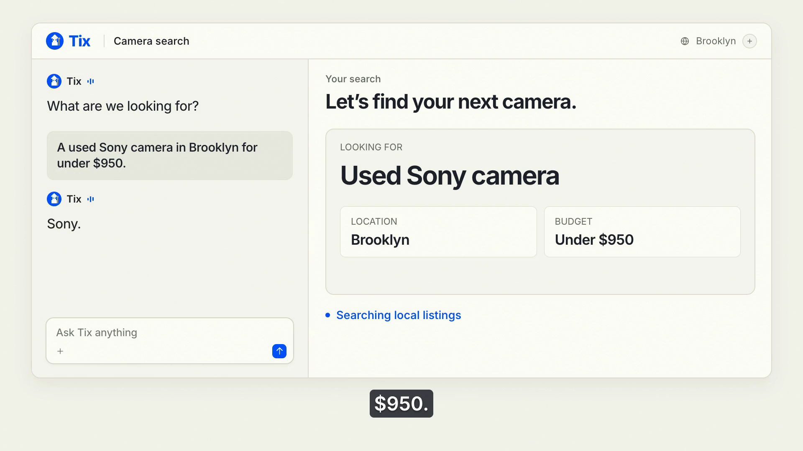

# Meet Tix: Start Your Secondhand Hunt With a Conversation

A used Sony camera in Brooklyn for under $950. Here’s how Tix is being built around the brief you bring to the hunt.

You’re looking for a used Sony camera in Brooklyn and want to spend less than $950. A listing catches your eye. Before deciding whether to pursue it, you need to work out how well it fits the camera you had in mind and the amount you’re prepared to pay.

Tixmancer is a conversational app for secondhand finds, designed around the buying question you bring to it. Describe what you’re after in your own words, with the details that matter to you, and use that brief to think through the next decision.

The current preview uses stored simulations for marketplace results, notifications and wallet steps. Its conversations and saved context are designed around each user’s account. The *Dinner with Tix* film illustrates the intended experience; live marketplace access and purchases remain on the roadmap.

## Give the hunt a clear starting point

> I’m looking for a used Sony camera in Brooklyn for under $950.

That gives the conversation enough direction to begin. “Sony camera” describes the item you want, while Brooklyn sets the location. The amount tells Tix what you’re comfortable spending. In this example, $950 is the buyer’s chosen boundary.

Add the details that would affect your decision. If you want a particular model with a lens included, say so in the brief. You can also explain what you plan to use the camera for while you’re still considering different models. Put that context into the conversation so it captures the decision you’re trying to make.

Tix’s design starts with this conversation. A buyer brings an item and a location, then sets a personal limit. Someone selling secondhand gear can start with a listing and ask for help thinking through an offer. The starting point follows the person’s task.

*The buying brief as it appears in the Dinner with Tix product film.*

## Check the asking price against your limit

The price check in Tix’s preview compares a record’s asking price with the limit supplied by the buyer. For the camera example, that gives you a concrete question to answer when considering a candidate: does its asking price fit the amount you set?

Keep the wording of your brief precise. “Under $950” means less than $950. If you decide that the exact model matters more than the original amount, make that a deliberate change to your buying brief. A price limit is useful when it represents a decision you’ve made about your own budget.

Establishing market value requires supported evidence beyond that comparison. The preview leaves market value unknown. You can still use your personal limit to decide which candidates deserve more attention while you examine the details of an individual listing.

For a camera, read the model name and what comes with it. Check the stated condition against the photographs and note anything you’d want the seller to explain. If the lens description is unclear, make that a question for the seller before assessing the offer.

## Keep the next decision in view

A useful secondhand hunt has room for questions. In the Sony example, you might want to clarify what’s included before deciding whether to contact the seller. You could also decide to pass on a candidate and keep the original brief.

Tix’s preview is designed to keep conversations and saved context with the person’s account. The goal is to let you return to the buying question with the details you’ve already supplied available in the conversation. That matters when you pause to check a model or reconsider how much you want to spend.

A useful follow-up for the camera example would be:

> Help me work through this listing against my camera brief. What details would I need to clarify before deciding whether to pursue it?

## Where Tix goes from here

Tix’s roadmap includes active hunts connected to each account, along with photo and file attachments for listings. An active hunt would give the camera search a place to continue as the buyer considers candidates. Attachments would let people bring more of the listing into that conversation.

Live access through supported marketplace sources is planned. The roadmap also includes notification connectors chosen by the user, so the intended workflow can continue through a channel the person selects. Source support and the notification connection both need to be in place for that experience.

An optional wallet is a later part of the plan. The proposed purchase flow requires a supported seller and verified steps from spending permission through to a receipt. A user’s permission would have an amount cap and an expiry, with approval and a way to revoke it.

## Join the waitlist

[Join the waitlist](https://tixmancer.xyz/) · **tixmancer.xyz**
